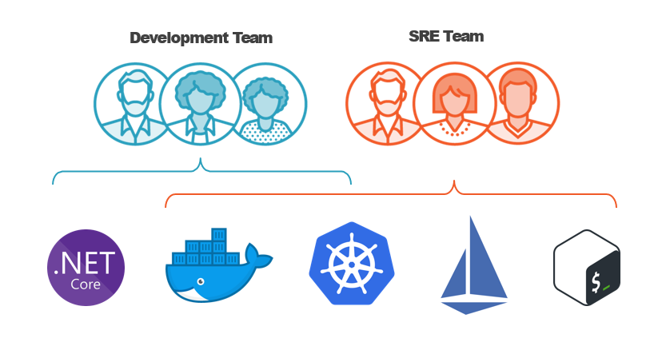

人工智能站点可靠性工程 (SRE) 利用人工智能来增强和自动化 SRE 实践。AI SRE 代理可以自主诊断、调查和解决事件，通常可以避免事件升级到人工值班团队。这项技术旨在减少人工劳动，提高系统可靠性，并加快事件响应速度。

用软件解决运维问题。标准化，自动化，可扩展，高可用是主要的工作内容。这个岗位被提出的时候，想解决的问题是打破开发人员想要快速迭代，与运维人员想要保持稳定，拒绝频繁更新之间的矛盾。

SRE 大致的工作内容从下往上分成 3 个大类：

Infrastructure：主要负责最基础的硬件设施，网络，类似于 IaaS，做的事情可参考 DigitalOcean

Platform：提供中间件技术，开箱即用的一些服务，类似于 PaaS，做的事情可参考 Heroku, GCP, AWS 等

业务 SRE：维护服务，应用，维护业务的正常运行

职位描述
1. 参与构建公司运维体系，制定和推进相关技术方案落地实施，对公司内部系统, 业务系统 SLA 负责.
SLA service level agreement服务水平协议 (SLA) 是一种外包和技术供应商合同，其中概述了供应商承诺向客户提供的服务水平。
2. 持续跟进业务迭代, 搭建自动化体系保证系统稳定性, 推进故障预防的规划与可用性建设.
3. 保障大数据/云原生/计算/存储/网络等多个核心系统的可靠性与正常运行，同时关注系统成本与稳定性；

[参考网站](https://blog.csdn.net/easylife206/article/details/126203782)