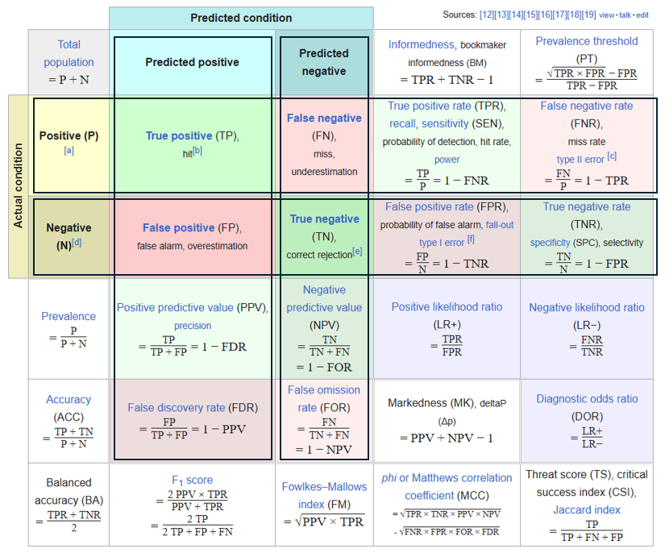

# confusion matrix混淆矩阵

**Accuracy 整体正确度**
预测正确的样本（TP和TN）在所有样本（all data）中占的比例

**F1 score** = 平衡 F分数（Balanced Score），最高值为 1.0，表示精确度和召回率完美；最低值为 0，表示精确度或召回率为零。
= 2/⁠(1/PPV + 1/TPR)
= 对 (预测为 正 里，预测 对 的比例) 与 (样本 正 里，预测 对 的比例) 求

PPV + FDR = 1 (预测为正的样本里，预测比例求和)

PPV Positive predictive value = **查准率，Precision 精确度** 
= 正正/预测为正的样本
= 在预测为positive的样本中，真实类别为positive的样本所占比例

FDR False discovery rate
= 负正/预测为正的样本

NPV + FOR = 1 (预测为负的样本里，预测比例求和)

NPV Negative predictive value
= 负负/(正负+负负) 
= 预测 负 里，预测 对 的比例

FOR False omission rate
= ⁠正负/(正负+负负) 
= 预测 负 里，预测 错 的比例

TPR + FNR = 1 (真实为正的样本里，预测比例求和)

TPR True positive rate = **查全率，recall召回率**, sensitivity (SEN)灵敏度, probability of detection, hit rate, power
= ⁠正正/真实为正的样本
= 在真实类别为positive的样本中，预测为positive的样本所占比例

FNR False negative rate = miss rate, type II error [c]
= ⁠正负/真实为正的样本

TNR + FPR = 1 (真实为负的样本里，预测比例求和)

TNR True negative rate = **特异性specificity (SPC)**, selectivity
= 负负/负
= 样本 负 里，预测 对 的比例

FPR False positive rate = probability of false alarm, fall-out, type I error
= 负正/负
= 样本 负 里，预测 错 的比例

**ROC曲线**在图像上越接近左上角(0,1)，模型越好。
ROC曲线
= 纵坐标True Positive Rate（TPR），横坐标False Positive Rate（FPR）。通过对分类阈值θ取值范围[0,1]（默认0.5）从大到小或者从小到大依次取值，我们可以得到很多组TPR和FPR的值，将其在图像中依次画出就可以得到一条ROC曲线。

**AUC值**
= 1 完美分类器
= 0.5 随机猜测效果
< 0.5 甚至不如随机答案
AUC Area Under Curve
= ROC曲线、横轴和直线FPR三者围成的面积。

Fowlkes–Mallows index (FM)
= 开根号(PPV × TPR)
= 对 (预测 正 里，预测 对 的比例) 与 (样本 正 里，预测 对 的比例) 开根号

Balanced accuracy (BA) 
= ⁠(TPR + TNR)/2
= 对 (样本 正 里，预测 对 的比例) 与 (样本 正 里，预测 对 的比例) 求平均

Prevalence 患病率 
= 正/所有 = 所有样本 里，样本 正 占比

参考
[维基全解](https://en.wikipedia.org/wiki/Confusion_matrix#Example)
[全面说明](https://blog.csdn.net/low5252/article/details/104429898)
[常见值的公式解析](https://www.cnblogs.com/wuliytTaotao/p/9285227.html)