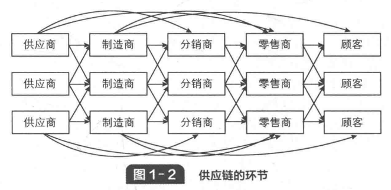

# 第一篇 构建分析供应链的战略框架

第一篇“构建分析供应链的战略框架”为理解企业成功与供应链管理之间的深层联系奠定了理论基础，核心在于**战略匹配**的概念，并探讨了如何实现和维持这种匹配。通过这三章的学习，读者可以掌握分析和设计供应链以支持公司竞争战略的整体框架。

供应链管理中的战略框架构建是一个复杂而系统的过程，它始于对供应链基本概念的理解，通过在战略设计阶段对设施、库存、运输、信息、采购和定价这六个关键要素的深思熟虑和优化配置，最终目标是实现公司竞争战略与供应链战略的完美匹配，以最大化整个供应链的价值。

## 第一章 理解供应链 (Understanding the Supply Chain)

是构建分析供应链战略框架的基础，它深入探讨了供应链的定义、目标、重要性、决策阶段、流程观点以及相关的实际案例，旨在帮助读者全面理解供应链的运作机制。

“理解供应链”在“战略框架构建”中的作用

设定目标：对供应链的定义和目标（最大化总剩余）的理解，为战略框架设定了明确的优化方向。框架的构建和驱动因素的调整都将围绕这一目标展开。

界定范围：理解供应链的构成方和环节有助于界定战略框架所要分析和涵盖的范围。只有了解了整个价值链的参与者，才能系统地进行设计和协调。

指导决策：对供应链决策阶段的认识强调了战略阶段决策的重要性，因为它决定了供应链的整体结构和长期能力。战略框架正是致力于在这一层面做出正确选择，以实现企业竞争战略与供应链战略的战略匹配。

分析视角：流程观点（循环和推/拉）和宏观流程（CRM、ISCM、SRM）提供了多维度分析供应链活动的工具。在构建战略框架时，管理者需要利用这些视角来识别供应链中的效率瓶颈和响应性差距，从而更有针对性地调整驱动因素。

优化杠杆：六个驱动因素（设施、库存、运输、信息、采购、定价）是战略框架中可操作的杠杆。对这些驱动因素的深入理解是管理层能够有效平衡效率与响应性、实现战略匹配的关键。例如，通过调整设施布局可以影响运输成本和响应时间，通过库存水平调整可以平衡满足需求和持有成本。信息尤其被强调为能够提升所有其他驱动因素价值，实现供应链高效和响应性的关键。

因此，对供应链的全面理解是构建和有效运用战略框架的基石，它指导了如何通过管理核心驱动因素来设计、规划和运营供应链，以实现最大的总剩余和持续的竞争优势。

### 1.1 什么是供应链 (What is a Supply Chain)

供应链的定义
供应链是指直接或间接地**满足顾客需求的各方**组成，它不仅包括制造商和供应商，还包括运输商、仓储商、零售商，甚至包括顾客本身。

供应链是一个**动态系统**，涉及不同环节间的信息、产品和资金的持续流动。

典型的供应链环节包括顾客、零售商、批发商/分销商、制造商和供应商/原材料供应商。
新产品开发、市场营销、生产运作、分销、财务和顾客服务。

### 1.2 供应链的目标 (Objective of a Supply Chain)

供应链管理的首要目标是最大化整个供应链的总剩余。

**供应链盈余 = 产品为顾客创造的价值- 供应链为满足顾客需求而产生的总成本。**

成功的供应链管理能够带来降低成本、增加营收以及提高产品可用性等多方面效益。

因此，在构建战略框架时，所有决策都应以此目标为导向。

### 1.3 供应链决策的重要性 (Importance of Supply Chain Decisions)

供应链设计、计划和运作的成功与否对公司的成功有重要作用。管理者需理解不同层面供应链决策的多样性，以及这些决策如何影响供应链绩效。

许多知名公司如沃尔玛、亚马逊、戴尔、欧莱雅等都因有效的供应链设计、计划和运作而取得了显著成功。相反，如Webvan和Borders等公司则因供应链决策的缺陷而面临挑战。

### 1.4 供应链的决策阶段 (Supply Chain Decision Phases)

供应链管理决策根据时间跨度可分为三个主要阶段：

- **战略或设计阶段**：此阶段决策供应链的**整体结构**，例如设施的选址和能力、各设施生产或储存的产品、运输方式以及信息系统等。这些决策具有**长期性**和难以逆转的特点。
此阶段的决策确定了供应链的整体结构。这包括设施（如工厂和仓库）的选址、能力和作用，各设施生产或储存的产品种类，产品在供应链各环节间的运输方式，以及信息系统等。这些决策通常是长期性的，一旦做出就很难逆转，因此需要仔细规划。
- **计划阶段**：此阶段确定如何在未来6-12个月内**最佳利用现有资源**供应链结构，包括生产计划、库存政策和运输策略。
在此阶段，企业利用已有的供应链结构，在未来6-12个月内做出如何最好地利用现有结构的决策。
- **运营阶段**：此阶段是日常或每周的决策，涉及**单个顾客订单的处理**，例如将订单分配到特定发货、设定交货日期等。目标是尽可能有效地处理顾客订单。
这是日常或每周的决策，涉及处理单个顾客订单，目标是尽可能高效地完成订单。 可见，战略或设计阶段的决策奠定了整个供应链运作的基础和限制。

### 1.5 供应链的流程观点 (Process View of a Supply Chain)

理解供应链流程有两种主要观点：

- 循环观点 (Cycle View)：将供应链操作分解为一系列循环，每个循环都发生在供应链中相邻两个环节之间。典型的循环包括：
        *   **顾客订单循环**
        *   **补货循环**
        *   **制造循环**
        *   **采购循环**
- 推/拉观点 (Push/Pull View)：根据流程是对顾客订单的响应（拉式）还是对预期顾客订单的预测（推式）来划分。
        *   **拉式流程 (Pull Processes)**：**顾客驱动**，是**对顾客订单的响应**。
        *   **推式流程 (Push Processes)**：**预测驱动**，是**基于预期顾客订单的预测**。
        *   推/拉界限的设定对供应链设计战略决策至关重要。

### 1.6 企业中供应链的宏观流程 (Macro Processes in a Supply Chain)

企业内部所有供应链活动可分为三个宏观流程，其成功整合至关重要：

*   **顾客关系管理 (Customer Relationship Management - CRM)**：所有**直接与顾客互动的流程**。例如，市场营销、销售、订单管理和呼叫中心管理等。
*   **内部供应链管理 (Internal Supply Chain Management - ISCM)**：**企业内部的所有流程**。例如，战略计划、需求计划、供应计划、履行和现场服务等。
*   **供应商关系管理 (Supplier Relationship Management - SRM)**：所有**直接与供应商互动的流程**。例如，货源选择、谈判、设计合作和供应合作等。

以上重要性：这些宏观流程控制着信息流、物流和资金流，并直接影响供应链的产出、接收和履行顾客订单的能力。

### 供应链举例

**实际应用场景：**
*   **沃尔玛**：其竞争战略是提供低价日常用品。其供应链的设计（战略阶段）高度聚焦于效率，通过先进的POS系统获取销售数据（信息流）并与供应商共享，实现了高效的库存管理（例如“交叉转运”）和配送，支持其低价定位和高资产周转率。
*   **亚马逊**：作为在线零售商，其供应链策略强调快速响应和产品多样性。通过在多个地点设立仓库并实现快速配送，满足了顾客对便利性和速度的需求。
*   **Zara**：其供应链以极高的响应性著称，能够快速适应时尚潮流变化，通过垂直整合和本地化生产，将设计到门店的时间压缩至几周，以应对时尚产品高度不确定的需求。
*   **Webvan 和 Borders**：这些公司未能成功应对技术和市场环境变化，导致其供应链失去了战略匹配，最终走向失败。例如，Webvan试图以高响应性满足生鲜配送需求，但未能有效控制成本。

### 学习目标小结

## 第二章 供应链绩效：实现战略匹配与拓展战略匹配范围 (Supply Chain Performance: Achieving Strategic Fit and Extending the Scope of Strategic Fit)

为理解企业成功与供应链管理之间的深层联系奠定了理论基础，核心在于**战略匹配**的概念，并探讨了如何实现和维持这种匹配。本章内容旨在帮助读者快速了解供应链战略的核心要素。

**战略匹配**是供应链成功的基石，即确保公司的竞争战略与供应链战略高度一致。它提供了一个框架，通过**理解顾客隐含需求的不确定性**和**评估供应链在效率与响应性之间的能力**，来实现这种匹配。

为了最大化整个供应链的总剩余，这种匹配需要**拓展到整个供应链的所有职能和环节**，并在面对不断变化的市场和技术环境时，认识到并应对**维持战略匹配的挑战**。

如果公司的竞争策略是
- 提供低成本产品，那么其供应链应被设计为高效型，注重成本最小化。
- 提供高响应性或创新产品，那么其供应链应被设计为响应型，以满足快速变化的顾客需求。 

### 2.1 竞争战略与供应链战略 (Competitive Strategy and Supply Chain Strategy)

公司的成功取决于其**竞争战略**与**供应链战略**之间的一致性,**战略匹配**。

*   **竞争战略**：指公司希望通过其产品或服务来满足的特定**客户需求**集合。定义了公司希望满足的客户需求，包括产品或服务。例如，沃尔玛的竞争战略是提供低价的日常用品，其供应链策略也围绕效率展开。例如，沃尔玛的竞争战略是提供低价的日常用品，而麦克马斯特-卡尔（McMaster-Carr）的策略则是快速提供各种维护、修理和运营（MRO）产品。
*   **供应链战略**：指**原材料采购、公司内部制造或服务提供、产品配送至顾客**等所有供应链活动的配置和执行方式。决定了如何配置供应链以支持竞争战略，包括设施、库存、运输、信息、采购和定价等方面的决策。它必须支持公司的竞争战略，例如沃尔玛的供应链策略就围绕效率展开，以支持其低价定位。
*   **战略匹配**：指**竞争战略与供应链战略之间的兼容性**，即**供应链的能力与顾客的隐含需求不确定性相匹配**。一个公司只有当其供应链能力能够支持其竞争战略的成功时，才能实现战略匹配。

**价值链**，强调公司内部从新产品开发到市场营销、生产、分销和服务等所有职能，以及财务、信息技术和人力资源等支持职能，都必须协同运作以创造顾客价值。每个职能策略都必须与公司的整体竞争策略保持一致。

### 2.2 实现战略匹配 (Achieving Strategic Fit)

实现战略匹配需要经历三个步骤：
1.  **理解顾客需求和供应链不确定性**：
    *   管理者需要识别并量化顾客需求的**隐含不确定性**。
    *   **隐含不确定性**：指**顾客需求对供应链施加的不确定性**，而非实际需求本身的不确定性。影响隐含不确定性的因素包括：
        *   **订单数量范围**：范围越大，隐含不确定性越高。
        *   **所需响应时间**：所需响应时间越短，隐含不确定性越高。
        *   **产品多样性**：产品种类越多，隐含不确定性越高。
        *   **服务水平**：服务水平要求越高，隐含不确定性越高。
        *   **预测更新速度**：预测更新越频繁，隐含不确定性越高。
    *   通常，**需求不确定性高的产品**（高度不确定的需求如新颖产品）需要更具**响应性**的供应链，而**需求不确定性低的产品**（可预测的需求如功能性产品）则更适合**效率型**供应链。
2.  **理解供应链能力**：
    *   供应链在**效率**和**响应性**之间存在权衡。
    *   **供应链响应性 (Supply Chain Responsiveness)**：指供应链能够**响应各种需求数量、满足短交货期、处理大量产品种类、满足高服务水平以及应对供应不确定性**的能力。构成供应链响应能力的成分越多,其响应性就越好。
    *   **供应链效率 (Supply Chain Efficiency)**：指供应链在满足顾客需求时，**成本尽可能低**的能力。
    *   效率高的供应链成本较低但响应较慢，响应性强的供应链则成本较高但能快速响应需求。
    *   公司需要了解其供应链在**效率与响应性权衡曲线**上的位置，这条曲线代表了在给定响应性水平下所能实现的最低成本。
    *   
3.  **实现战略匹配**：
    *   确保供应链的**效率与响应性水平**与顾客的**隐含需求不确定性**相匹配。
    *   对于**高隐含不确定性需求**，例如，需求不确定性高的产品（如新手机）应采用**响应型供应链**，其目标是快速响应需求、创新和可用性，以支持高价值产品。
    *   对于**低隐含不确定性需求**，例如，需求不确定性低的产品（如盐）应采用**效率型供应链**，其目标是低成本和高资产周转率，以支持大宗商品和成熟产品。
    *   此外，公司应根据产品的**生命周期**和**需求特性**（如Zara根据时尚潮流调整供应链），采取**量身定制的供应链**策略，以在不同产品之间实现效率和响应性的平衡。

### 2.3 拓展战略匹配范围 (Extending the Scope of Strategic Fit)

战略匹配不应局限于公司内部的单一职能，而应**拓展到整个供应链的所有环节和所有职能**，以最大化整个供应链的总剩余。
目标是最大化整个供应链的**总剩余**，而非仅仅关注单个环节或公司的利润。
这包括**内部职能间的协调**（如客户关系管理、内部供应链管理、供应商关系管理宏观流程的整合）和**公司间协调**。
*   **业务匹配**：公司内部所有职能（如营销、运营、财务、信息技术等）的战略都应与竞争战略保持一致，以最大化公司利润。
*   **职能匹配**：企业内部的**顾客关系管理 (CRM)、内部供应链管理 (ISCM) 和供应商关系管理 (SRM)** 这三大宏观流程的策略必须相互协调，打破职能壁垒，以最大化公司利润。
*   **公司间匹配**：公司与其他供应链合作伙伴（如供应商和客户）的战略必须协同一致，共享信息和目标，以最大化整个供应链的总剩余，而非仅仅关注个体公司的利润。
*   **灵活的战略匹配**：在动态变化的商业环境中，供应链应具备**灵活性**，能够适应不断变化的产品特性、需求、技术和商业环境，以持续保持战略匹配。

### 2.4 实现和维持战略匹配所面临的挑战 (Challenges to Achieving and Maintaining Strategic Fit)

在动态变化的现实商业环境中，维持战略匹配面临多重挑战，包括：
*   **产品种类增加和产品生命周期缩短**，导致需求不确定性增加，供应链需要更快地适应和创新。
*   **全球化**和随之而来的不断增加的**不确定性**增加供应链的复杂性和风险，如地理、政治和经济不确定性。
*   **供应链所有权分散**，供应链由多个独立实体构成，各方目标可能不一致，难以协调。
*   **技术和商业环境的不断变化**，技术进步和商业模式演变要求供应链不断适应和转型，例如Webvan和Borders的失败案例凸显了未能适应技术和市场变化的风险。
*   **环境和可持续发展**日益增长的环境和社会责任要求供应链在效率和响应性之外，还需考虑可持续性因素。

### 2.5 学习目标小结 (Learning Objectives Summary)**
本章的关键学习目标包括：
*   理解战略匹配对公司成功的重要性。
*   掌握如何通过理解顾客需求和供应链能力来**实现竞争战略与供应链战略之间的战略匹配**。
*   解释如何将战略匹配的范围**拓展到公司内部所有职能以及供应链的所有环节**。
*   讨论在不断变化的环境中，实现和维持战略匹配所面临的**主要挑战**。

### 实际应用场景

*   **Zara**：通过快速响应的供应链，能够快速将最新的时尚设计推向市场，以应对时尚产品的高度不确定性需求，实现了与竞争战略的完美匹配。
*   **IKEA**：其供应链利用模块化设计和顾客自行组装，以及高效的仓储和配送，实现了低成本和高效率，与提供经济实惠家具的竞争战略相匹配。
*   **Barilla**：通过集中化生产和分销，利用规模经济，提高效率，适合需求相对稳定的意面产品，强调效率型供应链。
*   **McMaster-Carr**：为MRO（维护、修理和运营）产品提供广泛选择和快速交货，其供应链高度响应，即使成本较高，也满足了客户对高可用性和速度的需求。

## 第三章 供应链驱动因素与衡量指标 (Supply Chain Drivers and Metrics)

### 3.1 绩效的财务指标 (Financial Metrics of Performance)

供应链的最终目标是**最大化供应链盈余**，这要求最大化客户获得的价值并最小化供应链成本。因此，供应链的有效管理能够提升诸如**净资产收益率（ROE）**等关键财务指标。

*   **核心财务指标**：包括**净资产收益率 (ROE)**、**资产周转率**、**库存周转率**、**应付账款周转率**和**现金周转期**等。
*   **实际应用**：通过比较不同公司（如亚马逊和诺德斯特罗姆）的财务表现，可以分析不同策略对财务绩效的影响，例如亚马逊通过高资产周转率实现高ROE，而诺德斯特罗姆则通过较高的利润率实现高ROE。

### 3.2 供应链绩效的驱动因素 (Supply Chain Performance Drivers)

为实现供应链的效率和响应性之间的**战略匹配**，需要借助供应链的**驱动因素**。这些驱动因素是管理者可以用来调整供应链结构和流程的杠杆，它们决定了供应链在效率与响应性权衡曲线上的位置。

供应链的绩效由六个驱动因素决定，这些因素可以帮助管理者设计和调整供应链，以实现**效率和响应性**之间的最佳平衡。

这些驱动因素分为两大类：
*   **1.物流驱动因素 (Physical Drivers)**：
    *   **设施 (Facilities)**：供应链中用于生产和存储的物理地点。
    *   **库存 (Inventory)**：供应链中存储的所有原材料、在制品和产成品。
    *   **运输 (Transportation)**：产品在供应链中的移动方式。
*   **2.跨职能驱动因素 (Cross-functional Drivers)**：
    *   **信息 (Information)**：关于供应链各方面的数据和分析。
    *   **采购 (Sourcing)**：公司选择供应商、采购原材料和服务的方式。
    *   **定价 (Pricing)**：公司向客户收取产品或服务的费用。

通过对上述六个驱动因素的巧妙配置和管理，管理者能够调整供应链在效率和响应性之间的平衡，从而使其与公司的竞争战略相匹配，最终实现供应链总剩余的最大化。

### 3.3 驱动因素的框架结构 (Framework for Drivers)
本小节提出了一个将**竞争战略与供应链战略**相结合的框架，说明如何通过**设施、库存、运输、信息、采购和定价**这六个驱动因素来实现**效率与响应性**之间的平衡，进而支持公司整体的竞争战略。例如，沃尔玛的竞争策略是低价销售日常用品，其供应链通过集中配送中心、低库存、自有车队、共享信息和低价采购等方式，实现了高效率，从而支持了其低价定位。

### 3.4 设施 (Facilities)
设施是供应链中的**物理场所**，包括生产和存储设施。
*   **影响**：设施的数量、位置、产能和柔性直接影响**供应链的效率和响应性**。例如，集中化设施通常能实现规模经济，提高效率，但响应性较低；分散化设施则能提高响应性，但可能增加成本。
*   **关键决策**：包括**设施数量、位置和分配产能**，以在效率和响应性之间取得平衡。
*   战略决策包括设施的作用（例如，专门用于生产或储存，或灵活用于多种用途）、位置（影响运输成本和市场响应性）、容量（决定能满足的需求量）和灵活性（适应需求和产品变化的能力）。设施决策对供应链的效率和响应性有显著影响，例如，靠近顾客的设施能提高响应性，但可能增加设施总数和成本。

### 3.5 库存 (Inventory)
库存是供应链中所有存储的原材料、在制品和产成品。
*   **影响**：**高库存通常能提高响应性**（满足紧急需求、处理需求波动），但会**降低效率**（增加持有成本、资产周转率低）；**低库存则相反**，能提高效率但可能影响响应性。
*   **主要组成（常见的库存类型包括）**：
    *   **周转库存 (Cycle Inventory)**：即满足两次交付之间需求。由生产或采购的批量大小决定，批量越大，周转库存越多，效率越高，但响应性可能降低。
    *   **安全库存 (Safety Inventory)**：用于应对需求和供应不确定性，提高产品可得性，但会增加持有成本。
    *   **季节性库存 (Seasonal Inventory)**：用于应对季节性需求波动，通过在旺季前生产来满足需求，提高效率，但需准确预测。

### 3.6 运输 (Transportation)
运输是产品在供应链中的移动方式，连接了供应链的各个环节。
*   **影响**：运输方式的选择直接影响**供应链的响应性和效率**。例如，快速运输（如空运）能提高响应性但成本高；慢速运输（如海运、铁路）效率高但响应性低。
*   **关键决策**：包括**运输网络设计、运输方式选择**（如陆运、海运、空运、铁路等）、**运输路线规划**和**货运整合**和承运商。以平衡速度、成本和产品在途中的可见性。不同的运输模式在成本、速度和灵活性之间存在权衡。
*   **实际应用**：Blue Nile（在线珠宝商）通过集中库存和利用快速运输，实现了高响应性，尽管其运输成本相对较高。

### 3.7 信息 (Information)
信息 (Information)：指关于设施、库存、运输、成本、价格和顾客等所有供应链的数据和分析。
信息是供应链中**最关键的驱动因素**，它贯穿所有其他驱动因素，并能**同时提高供应链的效率和响应性**。
*   **影响**：高质量的信息（如准确的需求数据）可以帮助公司更好地做出设施、库存和运输决策。信息共享和协同可以减少不确定性，提高预测准确性，从而实现更优的战略匹配。
*   **关键组成**：包括**需求预测**、**销售与运营计划**、**信息技术（如EDI、ERP）**和**供应链指标**。
*   **实际应用**：7-11便利店通过POS系统收集销售数据并与供应商共享，实现了高效的库存补货和配送，极大提高了其供应链效率。

### 3.8 采购 (Sourcing)
采购是决定**由谁来完成供应链中的活动**的决策，包括选择供应商、采购原材料和服务等。
*   **影响**：采购决策影响**供应链的成本和响应性**。例如，集中采购通常能获得规模经济，提高效率；而分散采购或选择多个供应商可能提高响应性或降低风险。
*   **关键决策**：包括**自制还是外包**、**供应商选择**、**采购流程设计**以及**与供应商的合作关系**。例如，外包可能带来成本效益但降低控制力，或增加交付时间。
*   **实际应用**：Zara根据产品类型采取不同的采购策略，对于需求可预测的基本款产品强调效率（如在亚洲采购）；对于需求不确定、时尚敏感的产品则强调响应性（如在欧洲采购）。

### 3.9 定价 (Pricing)
定价是公司向客户收取产品或服务的费用。定价策略会影响顾客需求、产品销量，进而影响供应链的盈利能力。战略定价直接影响顾客需求模式和产品销量，进而影响供应链的盈利能力。价格可以用来引导顾客需求，影响产品销量，并进一步影响供应链其他驱动因素的有效性。
*   **影响**：定价策略可以**影响需求模式**，从而影响**供应链的效率和响应性**。通过差异化定价或促销活动可以平滑需求波动，提高供应链利用率。
*   **关键决策**：包括**确定价格水平、定价细分市场、价格构成**（如成本加成、增量成本）以及**考虑竞争对手和市场环境**。
*   **实际应用**：亚马逊通过**动态定价**来吸引不同客户群体，并根据其**响应性需求**提供不同配送选项，以优化供应链的整体盈余。

### 3.10 学习目标小结 (Summary of Learning Objectives)
本章小结了供应链的目标是**最大化盈余**，并介绍了**设施、库存、运输、信息、采购和定价**这六个核心驱动因素。理解这些驱动因素如何影响供应链的**效率和响应性**，以及如何将它们与竞争战略**战略匹配**，是实现成功供应链的关键。

### 实际应用场景
*   **沃尔玛**：在设施方面，沃尔玛采用**集中化配送中心和跨码头配送**，实现极高效率。在库存方面，通过**低库存和高周转率**策略降低成本。在运输方面，依靠**自有车队**实现高效运输。在信息方面，通过**POS系统和信息共享**实现需求同步，进一步提高效率。
*   **亚马逊**：在设施方面，为提高响应性，在全球建立了**多个配送中心和仓库**。在库存方面，通过**大量备货**来确保产品可得性，提高响应性。在运输方面，大量使用**快速运输方式**以确保快速交货。
*   **McMaster-Carr**：其供应链在**库存**和**运输**方面偏向响应性，通过保持大量库存和快速运输，确保客户在24小时内收到MRO产品，尽管这增加了成本。
*   **Blue Nile (在线珠宝)**：在**信息**方面，利用线上平台提供丰富的产品信息和客户服务，提高了响应性。在**设施**和**库存**方面，通过集中库存降低了成本，从而实现了高效率。

# 第2篇 供应链网络的设计

深入探讨了供应链的物理基础设施建设，旨在实现效率与响应性之间的平衡，并支撑企业竞争战略。

一套构建高效且适应性强的供应链网络所需的理论和工具，特别强调了在复杂和不确定环境中进行战略决策的重要性。

深入探讨了企业如何构建其供应链的物理基础设施，以在效率和响应性之间取得平衡，并支持其整体竞争战略。本篇主要由第4、5、6章组成，分别聚焦于分销网络、整体网络设计以及全球供应链网络的设计。

## 第四章 分销网络的设计与在线销售的应用 (Designing Distribution Networks and Applications to Online Sales)

着重阐述了产品如何从制造商到达最终客户，以及在线销售如何影响这些设计选择。提供了关于分销网络设计选择的全面分析，并特别关注了在线销售如何重塑这些网络，以及企业如何通过明智的设计决策来平衡效率和响应性，从而支持其竞争战略。

分销网络是指产品从制造商送达最终客户的整个过程。
*   **影响分销网络绩效的因素**：分销网络的设计需要权衡**响应性**（如响应时间、产品多样性、产品可获性、客户体验等）和**效率**（成本）。增加设施数量可以提高响应性，但可能增加库存和设施成本，同时降低运输成本。
*   **分销网络设计方案**：本章分析了多种分销网络模式，包括：
    *   **制造商直接发货**（效率高、库存低，但运输成本高，响应性低）。
    *   **制造商在途合并**（效率和响应性平衡，通常用于高价值产品）。
    *   **分销商承运交付**（平衡效率和响应性，适用于中低需求、高价值产品）。
    *   **分销商送货上门**（响应性高，但成本高，通常用于大批量、低价值产品）。
    *   **制造商或分销商客户自提**（结合在线订购和实体取货，响应性中等，成本中等）。
    *   **零售商客户自提**（响应性最高，成本最低，但产品多样性和可获性可能受限）。
*   **在线销售的影响**：探讨了在线销售对分销网络的响应性、效率、库存、设施、运输、信息、采购和定价等驱动因素的深远影响。例如，在线销售通常能提供更高的产品多样性和信息共享，但可能面临更长的响应时间。

### 4.1 供应链中分销的作用 (Supply Chain's Role in Distribution)

**分销在供应链中的核心作用**，它指的是产品从制造环节或储存地点（如仓库）送达最终客户的整个过程。

分销网络的有效设计对于实现供应链的战略匹配至关重要，它直接影响着客户的体验和公司的盈利能力。

### 4.2 影响分销网络绩效的因素 (Factors Influencing Distribution Network Performance)

分销网络的设计需要在这两个关键维度之间进行权衡：
*   **响应性 (Responsiveness)**：这包括
    *   **响应时间**（客户收到产品所需时间）
    *   **产品多样性**（网络提供的产品种类）
    *   **产品可获性**（客户期望产品可得的程度）
    *   **客户体验**（购买过程的便捷性与舒适度）
    *   **订单可见性**（客户能否跟踪订单）
    *   **可退货性**（客户退货的便捷性）
    通常，增加分销设施的数量可以提高响应性。
*   **效率 (Efficiency)**：这主要体现在**成本**上，包括设施成本、库存成本和运输成本。例如，增加设施数量虽然可以缩短到客户的运输距离，降低运输成本，但会增加设施和库存的持有成本，从而可能导致总成本上升。因此，企业需要找到一个能够最小化总成本并同时满足响应性需求的分销网络结构。

### 4.3 分销网络设计方案 (Distribution Network Design Options)

详细分析了六种主要的分销网络设计方案，每种方案在响应性和效率之间有不同的权衡：

1.  **制造商直接发货 (Manufacturer Storage with Direct Shipping)**：
    *   **特点**：产品从制造商仓库直接运送给客户。
    *   **优点**：**库存集中化，降低总库存成本**，能够提供更广泛的产品种类。
    *   **缺点**：运输成本通常较高（因为需要将小包裹直接发送给大量客户），响应时间可能较长，客户体验可能受限。
    *   **适用**：适用于需求不确定、价值高、批量小且客户不急于收到货的产品。

2.  **制造商在途并货 (Manufacturer Storage with In-Transit Merge)**：
    *   **特点**：不同制造商生产的产品在运输途中合并成一个完整订单，再一起送达客户。
    *   **优点**：结合了制造商直接发货的库存集中优势，同时通过运输整合降低了部分运输成本，可以提供高产品多样性。
    *   **缺点**：信息基础设施投资较高，协调复杂。
    *   **适用**：通常用于高价值、多组件且客户愿意等待的产品。

3.  **分销商承运交付 (Distributor Storage with Carrier Delivery)**：
    *   **特点**：产品储存在分销商或零售商的仓库，由第三方承运商送达客户。
    *   **优点**：相对于制造商直运，响应性有所提高（运输距离缩短），且可以实现一定程度的库存集中，降低总库存。
    *   **缺点**：设施数量增多，设施成本和库存成本可能高于制造商直运。
    *   **适用**：适用于中低需求密度、高价值或季节性波动较大的产品。

4.  **分销商送货上门 (Distributor Storage with Last-Mile Delivery)**：
    *   **特点**：产品储存在分销商仓库，由分销商自己的车队送货上门。
    *   **优点**：**响应性高**（尤其适用于对时间敏感的客户），客户体验好。
    *   **缺点**：设施成本、运输成本和库存成本通常最高，因为它需要更多的分散设施和自有车队。
    *   **适用**：适用于高需求密度、大批量、低价值且客户需要及时收货的产品，如食品杂货。

5.  **制造商或分销商顾客自提 (Manufacturer/Distributor Storage with Customer Pickup)**：
    *   **特点**：客户在线订购，然后到指定的自提点（制造商或分销商设施）取货。
    *   **优点**：结合了在线销售的订单处理效率和实体取货的便捷性，可以提供较高的产品多样性，并降低最后一英里的运输成本。
    *   **缺点**：需要客户自行前往取货点，可能影响客户体验。
    *   **适用**：适合于对取货便捷性要求不高，但重视价格或产品多样性的客户。

6.  **零售商顾客自提 (Retail Storage with Customer Pickup)**：
    *   **特点**：产品储存在零售商店，客户直接从商店购买或在线订购后到商店自提。
    *   **优点**：**响应性最高**（即时可得），运输成本最低，客户体验良好。
    *   **缺点**：产品多样性和可获性可能受限于零售店的库存空间和商品种类，库存和设施成本可能较高。
    *   **适用**：适用于高需求密度、日常低价值的商品。

### 4.4 在线销售与分销网络 (Online Sales and Distribution Networks)

深入探讨了在线销售对分销网络的影响，特别是对供应链六大驱动因素的改变。在线销售通常能提供**更高的产品多样性**和更全面的产品信息，但同时也可能带来**更长的响应时间**和复杂的退货流程。

*   **设施**：在线销售通常倾向于更少的集中化设施，以降低设施和库存成本，但可能增加运输成本和响应时间。
*   **库存**：通过集中化库存，在线销售可以显著降低总库存量和库存持有成本，尤其对于长尾产品效果显著。
*   **运输**：在线销售通常会增加出向运输成本，因为需要直接向客户小批量发货。
*   **信息**：在线销售依赖于强大的信息系统，可以实现更高效的需求预测、订单管理和库存可见性，从而提高供应链的效率和响应性。
*   **采购和定价**：在线销售模式可以支持更灵活的采购和定价策略，例如通过动态定价吸引不同客户群体，或根据响应性提供不同配送选项。

本章通过多个案例（如Blue Nile、Peapod、Netflix与Blockbuster之争、Amazon与传统书店的竞争等）说明了在线销售公司如何通过其分销网络策略，在效率和响应性之间取得平衡，并最终影响企业绩效。

### 4.5 分销网络的实践 (Practices in Distribution Networks)
本小节总结了分销网络设计中的重要实践，强调所有权结构和类型对分销网络的影响，以及选择适合当前和未来市场变化的柔性分销网络的重要性。成功的在线销售企业需要能够理解客户需求、整合供应链各环节，并不断优化其分销策略以适应市场变化和技术发展。

### 4.6 学习目标小结

## 第5章 供应链网络设计 (Supply Chain Network Design)

深入探讨了企业供应链的**长期战略性决策**，包括设施的数量、位置、产能分配以及市场分配，这些决策对公司的长期盈利能力和竞争优势至关重要。

为企业构建和优化其供应链物理网络提供了全面的指导，从战略规划到具体选址和产能分配，强调了在复杂多变的环境中，**明智的网络设计是实现效率和响应性平衡，并支撑公司竞争优势的关键**。

供应链网络设计的**长期战略决策**，包括设施的数量、位置、产能分配以及市场分配。这些决策对公司的长期盈利能力至关重要。
*   **影响网络设计决策的因素**：除了响应性和效率的权衡，还需考虑**竞争战略、技术进步、宏观经济因素**（如税收、关税、汇率）、**政治因素**、以及**基础设施**和**竞争环境**等。
*   **网络设计决策框架**：提出了一个四阶段框架：
    1.  **明确供应链战略**：基于公司竞争战略确定供应链目标。
    2.  **确定区域设施配置**：根据需求预测、服务水平要求和区域成本，决定设施的数量和大致位置。
    3.  **选择理想的潜在地点**：在确定区域后，选择具体的设施地点。
    4.  **分配产能与市场**：将需求分配给特定设施，并确定每个设施的产能。
*   **设施选址和产能分配模型**：介绍了如何使用定量模型（如线性规划）来优化设施选址和产能分配决策，以最小化成本或最大化利润。

### 5.1 网络设计在供应链中的作用 (The Role of Design in the Supply Chain)

本小节首先明确了**网络设计在供应链中的核心作用**，它指的是对**设施（如工厂、仓库）的选址、制造、仓储或运输**，以及每个设施的**产能分配**和**市场分配**做出决策。这些决策直接影响供应链的效率和响应性。例如，丰田公司在全球各市场设立工厂，以便本地化生产并快速响应市场需求。

### 5.2 影响网络设计决策的因素 (Factors Influencing Design Decisions)

进行供应链网络设计决策时，需要综合考虑多种影响因素，以实现效率与响应性之间的平衡：
*   **竞争战略**：网络设计必须支持公司的整体竞争战略。例如，若公司追求低成本优势，设施倾向于集中化；若追求高响应性，则设施倾向于分散化以靠近客户。
*   **技术因素**：生产技术和信息技术的进步能够改变设施的规模经济性、自动化水平及对劳动力的需求，从而影响网络设计。例如，高度自动化的生产线可能意味着更少、规模更大的设施。
*   **宏观经济因素**：包括**税收、关税、汇率、汇率波动和运输成本**等。这些因素直接影响全球设施的选址和运营成本。例如，税收和关税政策会鼓励在特定区域设厂以享受优惠。
*   **政治因素**：政治稳定、法规环境以及贸易协定等都会对选址决策产生重大影响。
*   **基础设施因素**：现有基础设施的完善程度，如交通网络、港口、电力供应等，会影响设施选址的便利性和成本。
*   **竞争环境**：竞争对手的位置和战略会影响自身设施的布局，例如，为靠近竞争对手而设立设施以提高响应速度。

### 5.3 网络设计决策的框架 (A Framework for Network Design Decisions)

本章提出了一个**四阶段的决策框架**来指导供应链网络设计，其目标是最大化供应链利润：
1.  **阶段 I：明确供应链战略**：根据公司的竞争战略和长期预测，确定供应链的总体目标和优先级（例如，是侧重效率还是响应性）。
2.  **阶段 II：确定区域设施配置**：在满足客户需求和所需服务水平的前提下，根据区域需求预测和成本分析，确定设施的数量和大致地理区域。
3.  **阶段 III：选择理想的潜在地点**：在已确定的区域内，对具体的潜在设施地点进行详细评估，考虑土地成本、劳动力成本、基础设施、公用事业等微观因素。
4.  **阶段 IV：分配产能与市场**：将市场需求分配给具体的设施，并确定每个设施的产能。这一阶段通常使用定量模型来最小化总成本或最大化利润。

### 5.4 设施选址和产能分配模型 (Facility Location and Capacity Allocation Models)

本小节重点介绍了如何运用**定量模型**来优化设施选址和产能分配决策。这些模型通常是数学规划模型（例如，线性规划或整数规划），目标是最小化总成本（包括固定设施成本、可变生产成本、库存成本和运输成本）或最大化利润，同时满足市场需求和产能限制。书中通过 SunOil 公司等案例展示了如何运用此类模型来确定工厂选址和产品流向以最小化总成本。

### 5.5 网络设计决策的实践 (Practical Applications of Network Design)

本节强调，供应链网络设计决策具有**长期性和战略性**。由于这些决策一旦做出，**修正成本高昂且耗时**，因此在设计时必须充分考虑未来的不确定性。企业应选择能够应对未来变化的**柔性设计**，例如，在需求、技术、宏观经济和竞争环境不确定时，依然能够高效运营的网络。实践中还需要权衡**所有权结构**（自建设施或外包给第三方）对网络运营和绩效的影响。

### 5.6 学习目标小结

## 第6章 设计全球供应链网络 (Designing Global Supply Chain Networks)

快速了解全球供应链网络设计中的关键考虑因素和方法。核心是**在全球化和不确定性环境下，如何设计和管理全球供应链网络，以实现风险最小化和利润最大化**

本章将网络设计的概念扩展到**全球范围**，特别关注在全球化背景下如何管理**不确定性与风险**。
*   **全球化对网络的影响**：全球化带来了降低制造成本的机会，但也增加了运输成本、库存复杂性和风险。
*   **离岸外包决策**：详细分析了离岸外包的**总成本**，强调除了生产成本，还需考虑运输成本、库存持有成本、协调成本以及因不确定性带来的风险成本。
*   **全球供应链中的风险管理**：列举了多种风险，如中断风险、延迟风险、预测风险、知识产权风险、采购风险、库存风险和产能风险，并提出了相应的缓解策略。
*   **财务评估工具**：介绍了使用**贴现现金流 (DCF)** 方法来评估长期供应链设计决策的价值，将未来的现金流折算成现值，以考虑资金的时间价值。
*   **决策树的应用**：阐述了如何运用**决策树**来评估在不确定性环境下（如需求、汇率波动）的全球供应链设计方案，帮助管理者在不同情景下做出最优决策。

本章主要内容概括如下：

*   **全球化对供应链网络的影响 (6.1)**:
    *   全球化为供应链带来了**机遇与风险并存的局面**。
    *   在设计全球供应链网络时，需要**考虑需求和供应的不确定性，并管理好相关风险**。
    *   需要**平衡响应性和效率**。

*   **离岸外包决策: 总成本 (6.2)**:
    *   离岸外包决策不仅要考虑**生产成本**，还需要考虑**总成本**。
    *   总成本包括**运输时间、政治和汇率风险、运输成本、库存成本**等多种因素。

*   **全球供应链中的风险管理 (6.3)**:
    *   全球供应链面临的风险日益增加，如**中断、延迟、系统风险、预测风险、知识产权风险**等。
    *   为了有效管理这些风险，需要**采取适当的策略**，例如**提高灵活性、产品和生产的适应性、供应能力以及整合/聚合策略**。

*   **贴现现金流 (6.4)**:
    *   本节引入**贴现现金流 (DCF)** 方法，用于**评估全球供应链网络设计决策的净现值 (NPV)**。
    *   通过比较不同现金流的净现值，可以帮助管理者做出更好的投资决策。

*   **利用决策树评估网络设计决策 (6.5)**：
    *   **决策树是一种有效工具，用于在不确定性环境下评估供应链网络设计决策**。
    *   它能帮助管理者分析不同情景下的预期收益和风险，从而选择最优的策略。

*   **在岸或离岸: 不确定性环境下全球供应链设计决策的评估 (6.6)**：
    *   本节应用决策树方法，评估在**需求和汇率不确定性**下的在岸与离岸生产策略。
    *   通过计算不同方案在不确定性条件下的预期利润或净现值，以选择最佳的供应链网络配置。

*   **不确定性环境下全球供应链设计决策的实践 (6.7)**：
    *   强调**将战略规划与财务分析相结合**。
    *   建议**使用多种衡量指标**来评估供应链网络，并进行**敏感性分析**以更好地理解决策的关键因素。

### 6.1 全球化对供应链网络的影响 (The Impact of Globalization on Supply Chain Networks)

全球化极大地增加了供应链的规模，并可能带来成本降低和效率提升的优势。然而，它也显著增加了供应链面临的风险和不确定性，例如原材料价格、汇率、需求和供应的波动，以及中断风险（如自然灾害、地缘政治不稳定）。因此，企业在设计全球供应链网络时，需要超越传统关注点，充分考虑这些长期不确定性，以建立一个既能高效运营又具有灵活适应性的供应链。
*   全球化能够显著增加供应链的规模、降低成本并提高效率。
*   然而，全球化也带来了显著的风险和不确定性，企业在设计全球供应链网络时需要充分考虑这些长期不确定性。
*   源材料价格、汇率、需求和供应的不确定性，以及各种中断风险（如自然灾害、地缘政治不稳定）都可能对全球供应链绩效产生影响。
*   因此，企业需要建立灵活且适应性强的供应链，以平衡效率和响应能力。

### 6.2 离岸外包决策：总成本 (Offshoring Decision: Total Cost)

*   **离岸外包决策 (Offshoring decision)**：指企业将其生产活动转移到其他国家，通常是为了利用当地较低的劳动力成本来降低生产成本。
*   在做出离岸外包决策时，仅仅关注生产成本是不足够的，必须进行**总成本 (Total cost)**的全面评估。总成本不仅包括直接的生产成本，还涵盖一系列隐性成本和风险，例如：
    *   **供应商价格 (Supplier price)**：产品或原材料的采购价格。
    *   **劳动力成本 (Labor cost)**：在生产过程中产生的劳务费用。
    *   **物流成本 (Logistics cost)**：包括运输、存储和处理等费用。
    *   **库存成本 (Inventory cost)**：由于提前期延长和不确定性增加，可能导致库存持有成本上升。
    *   **关税与税费 (Tariffs and taxes)**：国家对进口商品征收的税费。
    *   **汇率波动 (Exchange rate fluctuation)**：货币汇率的变化会影响成本和收益，是离岸外包的重要风险来源。
    *   **风险与政治因素 (Risk and political factors)**：包括地缘政治不稳定、供应商破产、质量问题、提前期长、沟通障碍等。
*   许多公司发现，由于未能充分考虑这些隐性成本，实际的离岸外包总成本往往高于最初的估计。因此，成功的离岸外包需要对所有成本因素进行全面评估。

### 6.3 全球供应链中的风险管理 (Risk Management in Supply Chains)

当前全球供应链面临着日益增长的风险，如地缘政治不稳定性、自然灾害、需求和供应波动等。有效的风险管理是供应链成功的关键。
*   **常见的风险类型**包括：
    *   **中断 (Disruption)**：如自然灾害、供应商破产、地缘政治不稳定。
    *   **延迟 (Delay)**：可能由高产能利用率、供应商质量差、信息基础设施故障等引起。
    *   **预测风险 (Forecast risk)**：因需求预测不准确而导致库存过剩或短缺。
    *   **汇率风险 (Exchange rate risk)**：货币波动对成本和利润的影响。
    *   **采购风险 (Procurement risk)**：原材料价格波动或供应商产能不足。
    *   **库存风险 (Inventory risk)**：库存持有成本高、提前期长导致库存增加。
    *   **产能风险 (Capacity risk)**：生产能力不足或缺乏柔性。
*   企业可以通过多种策略来管理这些风险，例如：
    *   **增加冗余 (Increasing redundancy)**：如备用供应商、安全库存等，以应对中断和延误。
    *   **提高响应能力 (Increasing responsiveness)**：快速适应需求和供应的变化。
    *   **整合或聚合 (Integration or aggregation)**：将多个环节或功能集中化，以简化运营、降低风险。
    *   **提高灵活性 (Increasing flexibility)**：设计供应链使其能够适应多种产品、需求和供应情景，例如通过增加产品柔性或生产柔性来应对不确定性。
    *   **增加产能 (Increasing capacity)**：在生产能力上留有缓冲，以应对需求高峰或供应中断。

### 6.4 贴现现金流 (Discounted Cash Flow)

*   **贴现现金流 (Discounted Cash Flow, DCF) 分析**：是一种财务估值方法，用于评估供应链设计中投资选项的盈利能力，通过将未来现金流折算成现值来做出决策。
*   **概念**：未来的利润或现金流（C_t）在评估时需要根据一个**贴现率 (k)** 折算成当前的价值，因为货币具有时间价值。
*   **公式 (详细说明)**：净现值 (NPV) = Σ (未来现金流 / (1+k)^t)。
净现值 (NPV) = Σ (未来现金流 / (1+k)^t)。其中，NPV 代表净现值，C_t 代表第 t 期的现金流，k 代表贴现率，t 代表时间周期。这个公式将未来不同时间点的现金流折算到当前时点，从而可以比较不同投资方案的真实价值。
*   **应用**：DCF 广泛应用于供应链决策中，帮助管理层评估不同投资方案（如建造新仓库、签订租赁合同等）在整个生命周期内的财务影响，从而最大化供应链的利润。

### 6.5 利用决策树评估网络设计决策 (Using Decision Trees to Evaluate Network Design Decisions)

*   **决策树 (Decision tree)**：是一种在不确定性条件下分析决策的图形工具，特别适用于评估供应链网络设计决策。
*   **决策树的组成部分**：
    *   **节点 (Nodes)**：表示关键点。方形节点表示**决策点**，即需要做出选择的地方；圆形节点表示**随机事件**，即结果不确定的事件，通常伴随概率；三角形节点表示**终止点**，即决策路径的终点，显示最终结果。
    *   **分支 (Branches)**：从节点引出的线条，代表决策的替代方案或随机事件的可能结果。
*   **评估流程**：定义问题周期，识别关键不确定性及其发生的概率，定义决策序列，列出每个决策的替代方案，确定每个替代方案的预期结果，并从决策树的末端（终止点）向后计算各路径的预期净现值，最终确定最佳决策路径。
*   **益处**：决策树为复杂的、包含不确定性的供应链决策提供了结构化的分析方法，帮助管理层量化风险，理解不同情景下的潜在结果，并做出明智的选择。

cj：原来有书面应用！牛

### 6.6 在岸或离岸：不确定性环境下全球供应链设计决策的评估 (Onshore or Offshore: Evaluating Global Supply Chain Design Decisions Under Uncertainty)

本节详细展示了如何运用贴现现金流和决策树工具，在需求和汇率等不确定性环境下评估全球供应链的**在岸 (Onshore)**和**离岸 (Offshore)**生产决策。

以 D-Solar 公司为例，该公司需要决定在欧洲（在岸）或中国（离岸）生产太阳能电池板。通过模拟在不同需求（高/低）和汇率（有利/不利）情景下的预期利润，并将其折算成净现值，管理层可以量化比较在岸和离岸方案的财务表现和风险。这种分析强调了在全球供应链中，灵活性（如产能调整）能够缓解不确定性带来的负面影响。

### 6.7 不确定性环境下全球供应链设计决策的实践 (Practical Considerations for Global Supply Chain Design Decisions Under Uncertainty)

本节总结了在不确定性环境下进行全球供应链设计决策的实际应用和最佳实践。
*   **关键实践包括**：
    1.  **整合战略与财务分析 (Integrating strategic and financial analysis)**：供应链网络设计决策必须与公司的竞争战略保持一致，并得到严谨财务分析的支持。在分析时，需要将不确定性（如需求、价格、汇率和提前期波动）纳入考量。
    2.  **使用多重衡量指标 (Using multiple metrics)**：在评估网络设计方案时，应使用多维度的衡量指标，包括财务指标（如利润、投资回报率）、运营指标（如响应能力、灵活性）以及客户相关指标（如客户满意度）。
    3.  **重视财务分析 (Emphasizing financial analysis)**：尽管存在不确定性，财务分析仍然至关重要。应全面评估所有潜在结果，并量化不同方案的财务影响。
    4.  **进行敏感性分析 (Conducting sensitivity analysis)**：通过改变关键变量（如需求、汇率）来观察其对决策结果的影响，从而识别出对决策最敏感的因素和主要的风险来源。

### 6.8 学习目标小结 (Summary of Learning Objectives)

*   识别全球供应链决策中需要考虑的所有总成本因素。
*   认识到在全球供应链设计中不确定性的重要性。
*   理解如何运用风险缓解策略来应对不确定性。
*   掌握用于评估不确定性环境下全球供应链设计决策的量化方法，特别是贴现现金流和决策树分析。