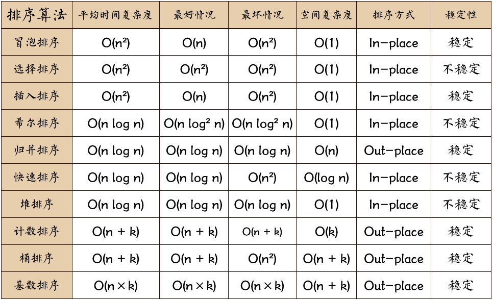

# 对一个无序数组，根据某个关键字排序。

# 划分方法
排序算法划分方法有：稳定性，内外排序，时空复杂度

按照稳定性划分，稳定排序，如果a原本在b前面，而a=b，排序之后a仍然在b的前面；而不稳定可能出现在b之后。

按照内外排序划分，内排序，所有排序操作都在内存中完成；外排序 ：由于数据太大，因此把数据放在磁盘中，而排序通过磁盘和内存的数据传输才能进行；

按照时空复杂度划分，时间复杂度是指运行时间，空间复杂度运行完一个程序所需内存的大小。

# python内置函数：
intervals.sort(key=lambda x: x[0])`：按照每个区间的起点由小到大排序。
sorted(nums)

# 
[动图](https://leetcode.cn/problems/sort-an-array/solutions/179370/python-shi-xian-de-shi-da-jing-dian-pai-xu-suan-fa)
选择排序（Selection Sort），从头开始找最值，双层循环遍历。数组实现不稳定，链表实现稳定。内排序。O(n^2 )。
冒泡排序（Bubble Sort），邻居间比然后换位，大的沉底。稳定排序。内排序。O(n^2)。
插入排序（Insertion Sort），逐个处理插入到已排好的序列中。稳定排序。内排序。O(n^2)。
希尔排序（Shell Sort），间隔位比然后换位，逐步缩小间隔位。非稳定排序。内排序。O(nlogn)。
归并排序（Merge Sort），先将数组分成子序列再将子序列间有序最后合并成有序数组。稳定排序，外排序，O(nlogn)。
快速排序（Quick Sort），将小于放在“哨兵”(pivot)左边大于放在右边，然后递归。不稳定排序，内排序，O(nlogn)。
堆排序（Heap Sort），（优先队列）使用一个大小为 k 的最小堆。遍历数组，将元素逐个加入堆中。如果堆的大小超过 k，就弹出堆顶（最小）的元素。遍历结束后，堆顶的元素就是我们要求的第 k 个最大元素。不稳定排序，内排序，时间复杂度为O(nlogn)。
计数排序（Counting Sort），空间换时间。稳定排序，外排序，时间复杂度O(n+k)，但是对于数据范围很大的数组，需要大量时间和内存。
桶排序（Bucket Sort），输入数据服从均匀分布的，将数据分到有限数量的桶里，每个桶再分别排序（有可能再使用别的算法或是以递归方式继续使用桶排序，此文编码采用递归方式）。
基数排序（Radix Sort）,基数排序是对数字每一位进行排序，从最低位开始排序。稳定排序，外排序，时间复杂度 posCount∗(n+n) ，其中 posCount 为数组中最大元素的最高位数；简化下得：O(k∗n)；其中k为常数，n为元素个数。
快速选择排序，。